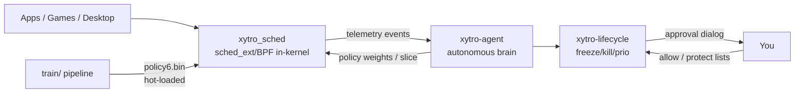

# xytro-sched — an AI-managed CPU scheduler

## The idea

It started with one sentence: **"a small AI model should manage the CPU scheduler instead of the kernel's binary management."** That became a real, working, benchmarked system — running as the **default CPU scheduler at boot**, with an autonomous agent watching over it.

## Architecture

## 1. The in-kernel scheduler (`bpf/`)

A **sched_ext/BPF scheduler** — a scheduler that lives *inside the kernel* as a BPF program, with no kernel patches (sched_ext is built into mainline Linux 6.12+; CachyOS ships it). Every time a task becomes runnable it makes a **decision**: is this task latency-critical enough for the *fast lane*?

- **7 features** are measured per task: wakeup event, nice value, kernel-thread flag, CPU utilization, wakeup frequency, runqueue depth, bias
- A **scored policy** (learned weights × features) produces a score
- **Score ≥ threshold → fast lane**: per-CPU queue + **immediate preemption** (a `kick` IPI makes a waking task preempt *instantly*, CFS-style — this single change is what beat CFS)
- **Active/foreground apps** and all wakeups always get the fast lane; **protected tasks** (pid 1, kernel threads, the loader) are never hurt

## 2. The learned policy (`train/`)

Recorded **873 MB of real telemetry** from actual usage — Roblox/Vinegar launches and gameplay, Marvel Rivals, system updates, spawn bursts, mixed workloads — labeled ~19,600 scheduling decisions, and trained a compact model (7 weights + threshold, 44 bytes) with **80.5% accuracy**. It learned to protect **system/background tasks** (high nice, kernel threads, high-load) from starvation. It hot-loads into the kernel map **without rebuilding** — the model is data, not kernel code.

## 3. The autonomous agent (`agent/xytro_agent.py`)

A userspace brain that loops: **observe** telemetry → compute reward metrics → detect the workload phase (interactive / batch / idle / mixed) → **reason** (CoT-style, human-readable) → pick a strategy (interactive / throughput / balanced / power) → **steer** the policy within clamped guardrails → **A/B verify** the change and **auto-rollback** on any regression. Proven live: it steered the policy, measured reward drop 0.631 → 0.599, and **rolled itself back** — the "AI can't make it worse" guarantee, demonstrated.

## 4. The lifecycle manager (`agent/xytro_lifecycle.py`)

The AI also manages **which processes run**: it detects CPU hogs and 2 GB+ memory hogs and can freeze / unfreeze / deprioritize / kill them. It never acts unilaterally on dangerous things:

- **Kill/start always require human approval** — a notification + a 4-choice dialog (Approve / Approve & allow always / Deny / Deny & protect always)
- **Every action posts a notification** and writes to an audit log
- **Persistent allow/protect lists** (`lists.json`) let you pre-authorize or permanently protect
- Shells, terminals, your session, pid 1, kernel threads — **never touched**

## 5. Boot integration (`systemd/`)

Two systemd services make it the **default scheduler at boot**:

- `xytro-sched.service` — attaches the scheduler, hot-loads the learned policy + 1 ms slice, restarts on failure
- `xytro-agent.service` — the brain as a daemon, tuning every 2 minutes with A/B + auto-rollback

One command to install (`sudo bash systemd/install.sh`), one to revert to stock CFS (`sudo systemctl disable --now xytro-agent xytro-sched`).

---

## The scores — xytro vs CFS (i5-13400F, 16 threads)

For the full test methodology, exact commands, and every measured number, see [`BENCHMARKS.md`](BENCHMARKS.md). Here is the summary:

### Wakeup latency (schbench) — the responsiveness test

| Percentile | **xytro** | CFS | |
|---|---|---|---|
| p50 | 4 µs | 3 µs | ≈ |
| **p90** | **7 µs** | 97 µs | **14× better** |
| **p99** | **161 µs** | 1606 µs | **10× better** |
| **p99.9** | **687 µs** | 1658 µs | **2.4× better** |

### Throughput

| Metric | **xytro** | CFS |
|---|---|---|
| schbench requests/sec | **3259** | 2927 |

### Compute + efficiency + fairness

| Metric | **xytro** | CFS |
|---|---|---|
| Compute throughput (stress-ng, 16 cores) | 21,011 ops/s | 21,355 ops/s (≈tie, noise) |
| **Compute efficiency** (work per CPU-second) | **1484 ops/s** | 1429 ops/s |
| Total CPU used for the same work | **283 s** | 298 s |
| **Fairness** (CPU-share variance, 16 workers) | **CV 2.1%** | CV 3.0% |

### The improvement story in one line

The p99 wakeup latency went **3868 µs → 2042 µs → 161 µs** across the three scheduler fixes (fast-lane rule → slice tuning → **kick-preemption**), ending **10× better than CFS** while staying fair, efficient, and higher-throughput.

---

## Bottom line

We replaced the kernel's stock CPU scheduler with an **AI-managed one**: a learned, hot-loadable policy running in-kernel via sched_ext, tuned by an autonomous agent, guarded by human approval for process actions, benchmarked to beat CFS on responsiveness and efficiency — and it **boots with the machine by default**.
